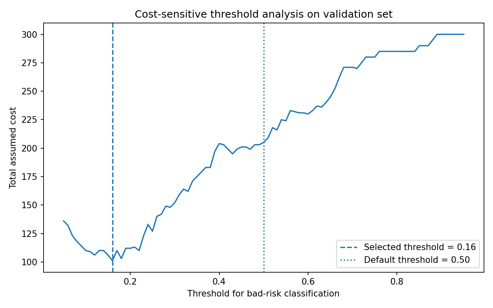
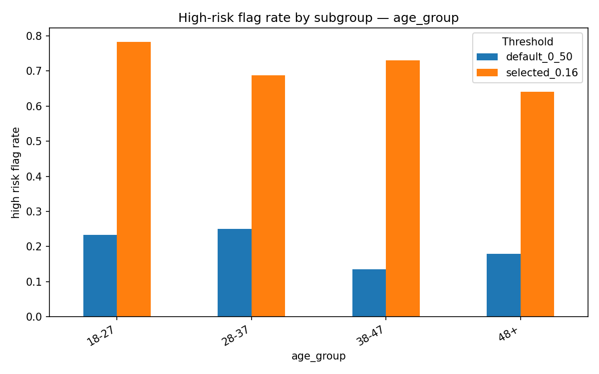
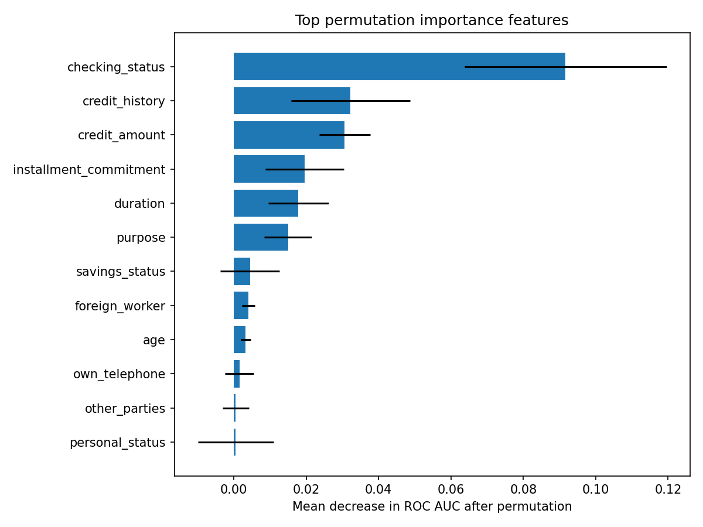

# Responsible AI Governance for Credit Risk Decision Support

This repository is a compact Responsible AI / AI Governance case study for a credit risk decision-support model.

It is not a Kaggle-style modelling project. The objective is to show how a credit risk model can be developed, tested, documented and challenged from a Responsible AI and model governance perspective.

The project is based on the Statlog German Credit Dataset and is framed as a simulated European banking use case. The model is treated as a decision-support tool, not as a fully automated credit approval or rejection system.

---

## Executive Summary

A calibrated logistic regression model was developed to predict bad credit risk.

The model shows reasonable baseline discrimination on the held-out test set:

| Metric | Value |
|---|---:|
| ROC AUC | 0.780 |
| Average precision | 0.612 |
| Brier score | 0.165 |

The main finding is not model performance. The main finding is the **governance impact of threshold selection**.

Using the German Credit asymmetric cost assumption, where false negatives cost 5 and false positives cost 1, the selected cost-sensitive threshold is `0.16`.

This threshold reduces missed bad-risk applicants but creates a much higher high-risk flag rate:

| Threshold | High-risk flag rate | False positives | False negatives | Interpretation |
|---:|---:|---:|---:|---|
| 0.50 | 21.0% | 16 | 34 | Conservative flagging, but many bad-risk applicants missed |
| 0.16 | 71.5% | 90 | 7 | Better bad-risk detection, but high customer-friction risk |

The model should therefore **not** be used for fully automated rejection. It may be considered for further controlled testing as a decision-support tool, subject to human review, subgroup monitoring, threshold review and feature governance.

---

## Project Objective

The project demonstrates how technical machine learning evidence can be translated into governance-relevant artefacts.

It covers:

- model development and performance evaluation;
- cost-sensitive threshold selection;
- calibration and probability quality;
- fairness and subgroup analysis;
- explainability review;
- AI risk and control documentation;
- testing evidence for Responsible AI review.

---

## Scenario

A European financial institution wants to assess whether a credit risk model could support loan application review.

The model predicts whether an applicant is likely to represent a higher credit risk. The output is a risk score that may support human credit officers, subject to credit policy, affordability checks, human review and documented reasoning.

This case study assumes that the model would not be used for fully automated rejection without additional legal, compliance, operational and human oversight controls.

---

## Audit Scope

| Component | Scope |
|---|---|
| Use case | Credit risk decision-support |
| Dataset | Statlog German Credit Dataset |
| Model role | Decision-support, not fully automated decisioning |
| Target | Good / bad credit risk |
| Sensitive or subgroup attributes tested | Gender, age group, foreign worker status |
| Performance metrics | ROC AUC, average precision, Brier score, accuracy, precision, recall, confusion matrix |
| Business metric | Cost-sensitive error analysis using the German Credit cost matrix |
| Fairness metrics | Favourable outcome rate, high-risk flag rate, disparate impact screen, false positive rate gap, false negative rate gap |
| Explainability | Permutation importance and proxy-sensitive feature review |
| Governance outputs | Model card, fairness assessment, AI risk-control matrix, testing summary |

---

## Repository Structure

~~~text
project-01-credit-scoring-responsible-ai/
│
├── README.md
│
├── notebooks/
│   ├── 01_model_development_and_thresholding.ipynb
│   └── 02_fairness_explainability_and_testing.ipynb
│
├── artefacts/
│   ├── model_card.md
│   ├── fairness_assessment.md
│   ├── ai_risk_and_controls.md
│   └── testing_summary.md
│
├── outputs/
│   ├── figures/
│   └── tables/
│
└── requirements.txt
~~~

---

## Main Deliverables

| Deliverable | Purpose |
|---|---|
| `01_model_development_and_thresholding.ipynb` | Develop baseline credit risk models, evaluate performance, assess calibration and select a cost-sensitive threshold |
| `02_fairness_explainability_and_testing.ipynb` | Test subgroup outcomes, fairness metrics, explainability and residual Responsible AI risks |
| `model_card.md` | Summarise model purpose, intended use, limitations, performance and governance constraints |
| `fairness_assessment.md` | Document subgroup analysis, fairness findings, limitations and mitigation options |
| `ai_risk_and_controls.md` | Map key AI risks to practical controls and residual risk levels |
| `testing_summary.md` | Provide a concise testing and validation summary for governance review |

---

## Current Status

| Area | Status |
|---|---|
| Repository structure | Complete for V1 |
| Notebook 01 — model development and thresholding | Complete |
| Notebook 02 — fairness, explainability and testing | Complete |
| Model card | To be completed |
| Fairness assessment | To be completed |
| AI risk and controls matrix | To be completed |
| Testing summary | To be completed |

---

## Responsible AI Findings

### 1. Threshold selection is the main governance issue

The selected threshold was chosen on the validation set using the German Credit asymmetric cost assumption:

| Error type | Interpretation | Assumed cost |
|---|---|---:|
| False negative | Bad credit risk classified as good | 5 |
| False positive | Good credit risk classified as bad | 1 |

This cost-sensitive approach reduces missed bad-risk applicants, but the selected threshold `0.16` flags 71.5% of applicants as high risk.

This is not treated as a deployment recommendation. It is treated as a governance finding.

---

### 2. Fairness review identifies age and foreign worker status as review triggers

Fairness testing was performed on:

- gender group;
- age group;
- foreign worker status.

The selected threshold created review triggers for age group and foreign worker status.

Key findings:

| Finding | Severity |
|---|---|
| Cost-sensitive threshold creates high flagging rate | High |
| Age-group disparity at default threshold | Medium |
| Foreign-worker-status disparity at default threshold | Medium |
| Age-group disparity at selected threshold | High |
| Foreign-worker-status disparity at selected threshold | High |
| Main model drivers require business and proxy review | Medium |

The foreign-worker-status finding should be interpreted carefully because the subgroup size is small. It is a high-priority review trigger, not a definitive legal conclusion.

---

### 3. Explainability review shows mostly credit-relevant drivers, with proxy-sensitive concerns

The top global drivers based on permutation importance were:

| Feature | Importance |
|---|---:|
| checking_status | 0.0916 |
| credit_history | 0.0322 |
| credit_amount | 0.0307 |
| installment_commitment | 0.0195 |
| duration | 0.0179 |
| purpose | 0.0150 |
| savings_status | 0.0045 |
| foreign_worker | 0.0040 |

Most top drivers are broadly credit-relevant. However, `foreign_worker` appears among the top drivers and should be reviewed as a proxy-sensitive feature before operational use.

---

## Methodological Approach

The project follows a simple Responsible AI assurance workflow:

~~~text
Data understanding
      ↓
Baseline model development
      ↓
Cost-sensitive threshold selection
      ↓
Fairness and subgroup testing
      ↓
Explainability review
      ↓
Risk-control documentation
      ↓
Conditional governance recommendation
~~~

The focus is not on maximizing predictive performance. The focus is on producing evidence that can support responsible model review.

---

## Key Governance Questions

The project is structured around the following questions:

1. Is the model performance sufficient for decision-support use?
2. Are the predicted probabilities sufficiently calibrated?
3. How does threshold selection affect business cost and customer impact?
4. Do model outcomes differ materially across relevant subgroups?
5. Are explanations sufficiently reliable for internal review and customer-facing reasoning?
6. What controls would be needed before deployment?
7. What residual risks would remain after mitigation?

---

## Preliminary Governance Recommendation

The candidate model is suitable for further controlled testing, not direct deployment.

Recommended position:

~~~text
Approve for controlled testing only.
Do not approve for fully automated rejection.
~~~

Required conditions before any operational use:

- use as decision-support only;
- no fully automated rejection;
- human review for adverse or borderline cases;
- documented reason codes;
- subgroup performance monitoring;
- threshold review before approval;
- review of proxy-sensitive features;
- periodic fairness reassessment.

The main issue is not only model performance. The selected cost-sensitive threshold improves bad-risk detection, but creates high customer-friction risk and fairness review triggers.

---

## Mitigation Position

No algorithmic mitigation is applied automatically in V1.

This is intentional. The project follows a diagnosis-first approach:

~~~text
diagnose subgroup and error disparities
      ↓
identify material governance risks
      ↓
select proportionate controls or mitigation
      ↓
re-test performance, fairness and operational impact
~~~

Mitigation options considered:

| Option | When relevant |
|---|---|
| Threshold adjustment | If the operating threshold creates excessive customer friction or subgroup disparity |
| Reweighing / sample weighting | If subgroup disadvantage is confirmed and stable |
| Feature review | If top drivers are sensitive or proxy-sensitive |
| Post-processing constraints | If error rates differ sharply across groups |
| Human review | If automated flagging is too aggressive for direct action |
| Monitoring | If the model proceeds to pilot |

For this V1, the main recommended controls are controlled use, human review, subgroup monitoring and threshold governance.

---

## Responsible AI Positioning

This project treats Responsible AI as an operational discipline, not as a set of abstract principles.

The analysis links technical ML work to governance controls:

| Technical issue | Governance relevance |
|---|---|
| Model performance | Determines whether the model is reliable enough for decision support |
| Calibration | Determines whether risk scores can be meaningfully interpreted |
| Threshold choice | Determines the balance between credit risk and customer exclusion |
| Fairness metrics | Identifies potential unequal impact across groups |
| Explainability | Supports internal review, adverse action reasoning and auditability |
| Monitoring | Defines how performance and fairness should be tracked after deployment |
| Human oversight | Reduces the risk of inappropriate reliance on model outputs |

---

## Artefacts

The artefacts are intentionally limited to a small number of high-signal documents.

| Artefact | Main question answered |
|---|---|
| Model card | What is the model, what is it for, how well does it perform, and what are its limitations? |
| Fairness assessment | Are there material subgroup disparities and what do they imply? |
| AI risk and controls | What are the main AI risks and what controls would reduce them? |
| Testing summary | Is the model ready for limited use, further testing or rejection? |

---

## Out of Scope for V1

To keep the project focused and portfolio-ready, the following are out of scope for the first version:

- full production MLOps implementation;
- full EU AI Act conformity assessment;
- complete ISO/IEC 42001 management system mapping;
- full NIST AI RMF control mapping;
- RACI matrix and committee operating model;
- AutoML benchmark;
- deep learning models;
- full bias mitigation benchmark;
- production monitoring dashboard;
- real customer data.

These may be added later if they improve the project’s relevance for specific roles.

---

## Limitations

This is a simulated governance case study based on a public dataset.

Main limitations:

- the German Credit Dataset is small and dated;
- the dataset does not represent a real modern banking portfolio;
- protected attributes are limited and imperfect;
- fairness analysis is illustrative, not a legal conclusion;
- subgroup findings are sensitive to small sample sizes;
- operational controls are proposed conceptually, not implemented in production;
- results should not be interpreted as a deployable credit scoring system.

The value of the project is in the Responsible AI workflow, not in the commercial validity of the model.

---

## References and Inspiration

This project is informed by public work on:

- credit scoring fairness analysis using the German Credit Dataset;
- cost-sensitive evaluation of credit risk models;
- fairness metrics such as disparate impact and equal opportunity;
- explainability methods such as permutation importance and SHAP-style reasoning;
- Responsible AI governance artefacts such as model cards, risk assessments and testing summaries;
- AI governance frameworks including the EU AI Act, ISO/IEC 42001 and the NIST AI Risk Management Framework.

Detailed references will be added as the artefacts are completed.

---

## Disclaimer

This repository is a personal portfolio project.
